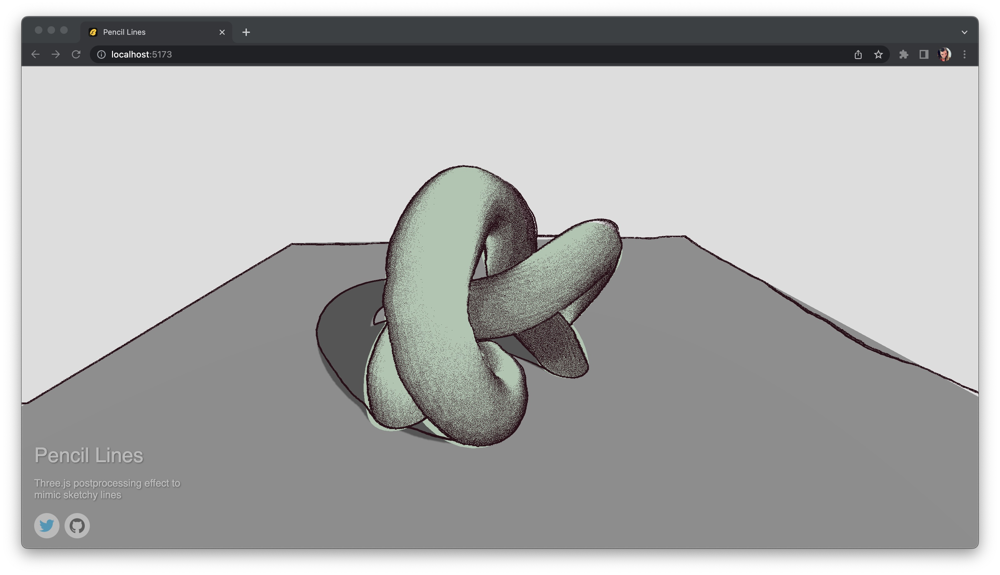

# Sketchy Pencil Lines Post-Processing Effect

✏️[Link to live demo](https://pencil-lines.vercel.app/)



## Prerequisites

- [Node.js](https://nodejs.org)
- [yarn](https://yarnpkg.com) OR [npm](https://www.npmjs.com)

> 💡 This project uses **yarn@3.2.1** and **npm@8.1.2**. Other versions might lead to different package resolutions, proceed with caution. Example commands use **yarn**.

## Development

To start the development server, run the following command:

```bash
yarn install
yarn dev
```

To build the project, run:

```bash
yarn build
```

And if you wish to automatically start a server to preview your build, you can run:

```bash
yarn build && yarn preview
```
